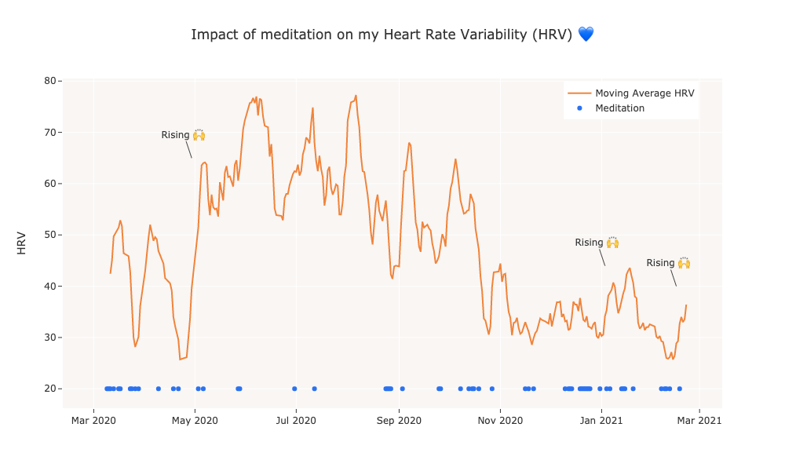
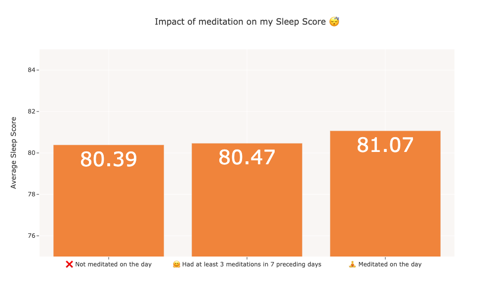

# Exploring impact of meditation on my sleep and health

I have been meditating on and off since March 2020. I was wondering if my meditation practice started to already impact my sleep and heart health. So, I analyzed my Oura Ring data with regards to meditation. This is what I found:

* Some studies suggest that meditation can have a positive impact on stress which manifests in increasing HRV, so I wanted to see if this was the case for me. My HRV rises indeed especially in the periods where I meditated more than usual. Other factors like a lot of cycling I did in the summer probably played an important role in my high HRV as well.

 

* My Sleep Score seems to be slightly better on the days of meditation or the days following my meditation sessions.

 

Of course, this was just a fun experiment and we can't conclude anything more serious. 😀
